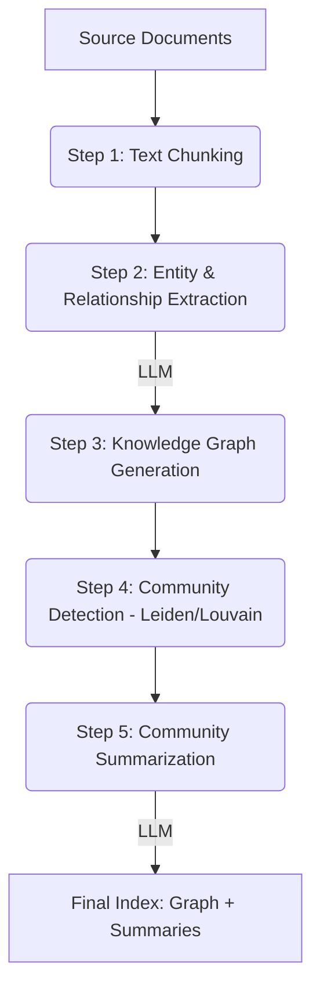
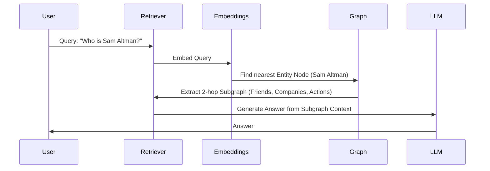
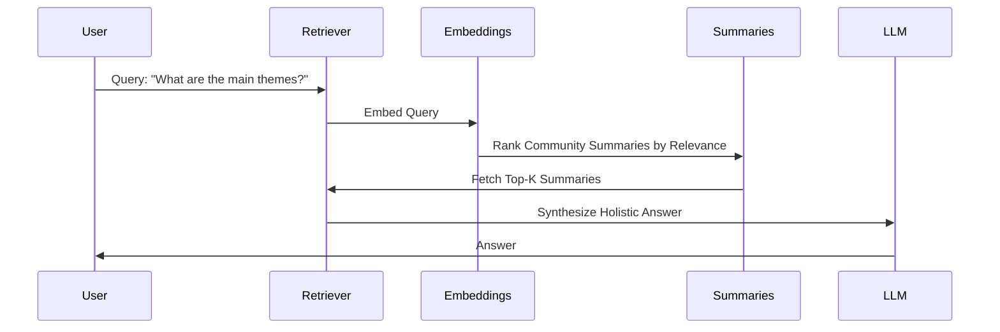

# GraphRAG: The Blueprint — Detailed Documentation


This document provides a comprehensive guide to the **GraphRAG** pipeline, a two-phase system designed for advanced document intelligence using Knowledge Graphs and LLMs.

---

## 1. System Architecture

The system is divided into two primary phases: **Indexing** (Graph Construction) and **Querying** (Retrieval & Generation).

### Phase 1: Indexing & Graph Construction
In this phase, raw documents are transformed into a structured knowledge graph.



#### Steps in Detail:
1.  **Text Chunking**: Documents are split into overlapping token-aware chunks (default 1200 tokens). This ensures context is preserved while staying within LLM window limits.
2.  **Entity & Relationship Extraction**: Each chunk is passed through an LLM (OpenAI or Ollama). The LLM identifies nodes (Entities) and edges (Relationships) using a strict JSON schema.
3.  **Graph Generation**: The extracted data is merged into a **NetworkX** graph. Duplicate entities are merged, and relationship weights are accumulated.
4.  **Community Detection**: A clustering algorithm (Leiden or Louvain) groups highly connected entities into "Communities". This allows the system to understand the "big picture" of different topics.
5.  **Community Summarization**: The LLM generates a thematic summary for every detected community.

---

## 2. Phase 2: Querying the Graph

When a user asks a question, the system uses one of two search strategies:

### Local Search (Specific Queries)
Best for questions about specific entities (e.g., *"Who is the CEO of Company X?"*).



### Global Search (Holistic Queries)
Best for broad, thematic questions (e.g., *"What are the main themes discussed in these documents?"*).



---

## 3. Ollama Integration (100% Local)

This implementation supports **Ollama** natively. By setting the `LLM_PROVIDER` to `ollama`, the system bypasses OpenAI and communicates with your local Ollama instance.

### Setup Requirements:
1.  **Install Ollama**: [ollama.com](https://ollama.com)
2.  **Pull Models**:
    ```bash
    ollama pull llama3         # For extraction & summarization
    ollama pull mxbai-embed-large # For embeddings
    ```
3.  **Configuration (`.env`)**:
    ```env
    LLM_PROVIDER=ollama
    OLLAMA_BASE_URL=http://localhost:11434/v1
    EXTRACTION_MODEL=llama3
    SUMMARIZATION_MODEL=llama3
    EMBEDDING_MODEL=mxbai-embed-large
    ```

---

## 4. UI Features

The built-in web dashboard provides a visual interface for the entire pipeline:

1.  **Dashboard**: Real-time stats (Node count, Edge count, Communities) and source file management.
2.  **Knowledge Graph**: An interactive D3 force-directed visualization. Zoom, drag, and filter entities by type.
3.  **Query Intelligence**: A chat interface that allows you to toggle between Local, Global, and Auto-routing modes.
4.  **Pipeline Control**: A real-time log terminal and progress tracker for indexing.

---

## 5. Technical Stack

- **The Brain (LLM)**: GPT-4o (OpenAI) or Llama3 (Ollama).
- **The Graph Store**: NetworkX (In-memory, persists to GraphML/Pickle).
- **The Vector Store**: In-memory semantic index for entities and summaries.
- **The API**: FastAPI (Python).
- **The Frontend**: Vanilla HTML5, CSS3, and JavaScript (D3.js).

---

## 6. How to Run

1.  **Prepare Environment**:
    ```bash
    python3.11 -m venv venv
    source venv/bin/activate
    pip install -r requirements.txt
    ```
2.  **Configure**: Create `.env` based on `.env.example`.
3.  **Start Server**:
    ```bash
    uvicorn server:app --reload --port 8000
    ```
4.  **Access**: Open [http://localhost:8000](http://localhost:8000) in your browser.
