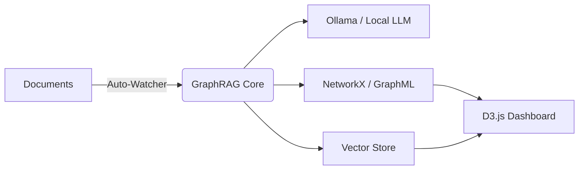

# 🕸️ GraphRAG Intelligence Engine


[](https://github.com/Anteneh-T-Tessema/graphrag/actions)
[](https://opensource.org/licenses/MIT)
[](https://ollama.com)

A production-grade, local-first implementation of the **GraphRAG** architecture. This system transforms raw documents into a structured, community-summarized Knowledge Graph, enabling deep semantic reasoning without any recurring API costs.

---

## 📚 Documentation Hub

Explore the system in extreme detail through our specialized guides:

| Guide | Description | Highlights |
| :--- | :--- | :--- |
| 🖼️ **[Visual Guide](VISUAL_GUIDE.md)** | **Best for Concept Learning.** Visualizes the entire engine. | 3D Architecture, Search Mode Split, Community Detection. |
| 📖 **[Deep Dive](DOCUMENTATION.md)** | **Best for Technical Reference.** How it works under the hood. | Step-by-step logic, API Endpoints, Configuration. |
| 🚀 **[Deployment Guide](docker-compose.yml)** | **Best for Production.** Running in the cloud. | GHCR Image, Docker Compose, Port mapping. |

---

## ✨ Key Features

- **🧠 100% Local & Private**: Powered by **Ollama (Llama 3)** and **Sentence-Transformers**. No data ever leaves your machine.
- **👁️ Real-Time Watcher**: A background service that monitors your `data/` folder and automatically indexes new files in real-time.
- **🖥️ Forever Background Service**: Native macOS/Linux installers that run the intelligence engine as a persistent system utility.
- **📊 Interactive D3 Visualization**: A premium web dashboard to explore your knowledge graph, nodes, and relationships.
- **🧬 Dual-Search Modes**: Switch between **Local Search** (precise facts) and **Global Search** (thematic synthesis).

---

## ⚡ Quick Start

### 1. Setup Environment
```bash
# Clone and enter
git clone https://github.com/Anteneh-T-Tessema/graphrag.git && cd graphrag

# Create venv and install
python3.11 -m venv venv
source venv/bin/activate
pip install -r requirements.txt
```

### 2. Configure Local AI
Create a `.env` file based on `.env.example` and set `LLM_PROVIDER=ollama`. Ensure **Ollama** is running on your machine.

### 3. Activate Background Intelligence
```bash
# Install as a native background service (Mac/Linux)
bash scripts/setup_service.sh
```

---

## 🏗️ Architecture at a Glance



For the full architectural sequence, see the **[Visual Guide](VISUAL_GUIDE.md)**.

---

## 🤝 Contributing

We welcome contributions! Please see our [CONTRIBUTING.md](CONTRIBUTING.md) for details on our code of conduct and the process for submitting pull requests.

---

© 2026 Anteneh T. Tessema. GraphRAG Intelligence Engine.
