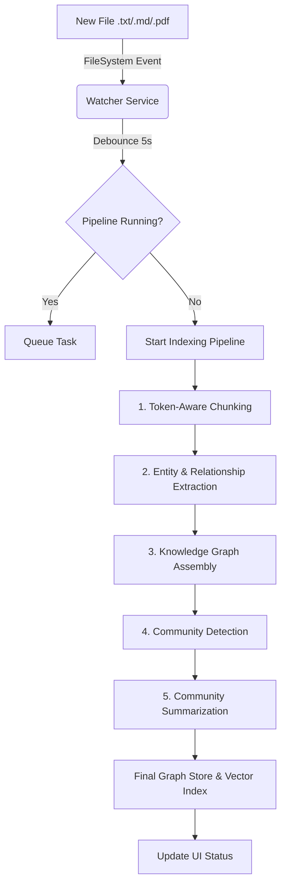
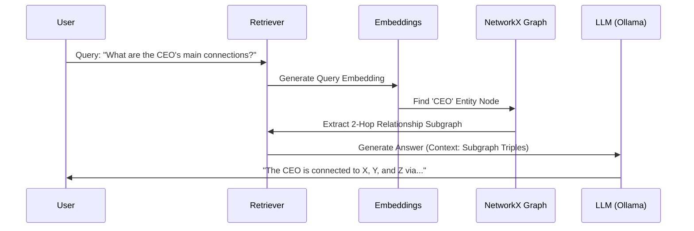
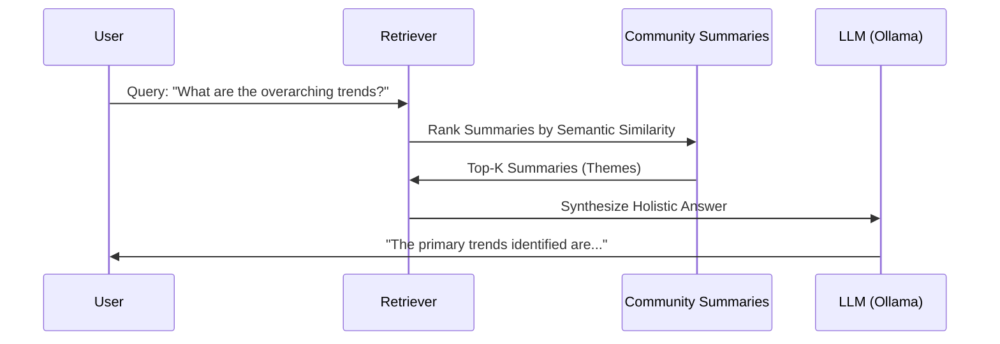
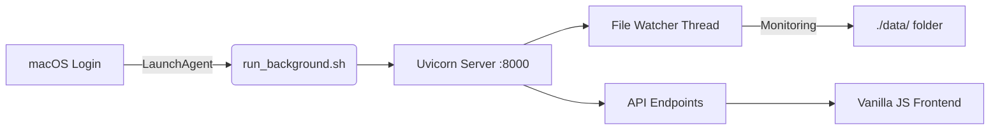
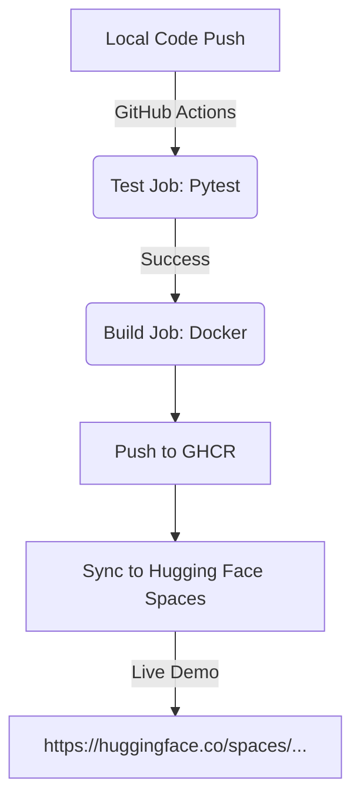

# GraphRAG Intelligence Engine — Deep Dive Documentation

This document provides an exhaustive, visual guide to the **GraphRAG Intelligence Engine**. It covers the end-to-end lifecycle of a document, from "dropping it in a folder" to "querying the collective intelligence."

---

## 1. The Autonomous "Watch-and-Index" Lifecycle

The system is designed to be zero-touch. The moment a file is added to your environment, a series of background events are triggered.

### 🔄 Data Ingestion Flowchart

---

## 2. Advanced Retrieval Strategies

GraphRAG doesn't just search for text; it understands **relationships** and **thematic structures**.

### 🔍 Local Search (Deep Context)
Best for specific entities. It extracts a "knowledge subgraph" around your query.

### 🌍 Global Search (Big Picture)
Best for "What are the main themes?" It uses pre-computed **Community Summaries**.

---

## 3. Background Persistence (Forever Free)

The engine runs as a native OS service, ensuring it's always ready without an open terminal.

### 🖥️ macOS/Linux Deployment Architecture

---

## 4. CI/CD & Cloud Pipeline

Your development workflow is automated from local push to global registry.

---

## 5. Technical Specification

| Component | Technology | Role |
|---|---|---|
| **Language** | Python 3.11 | Core Logic & API |
| **LLM Provider** | Ollama (Llama 3) | Extraction & Summarization |
| **Embeddings** | Sentence-Transformers | Local Semantic Search |
| **Graph Backend** | NetworkX / Neo4j | Relationship Storage |
| **Persistence** | GraphML & Pickle | Local Disk Storage |
| **Monitoring** | Watchdog | Real-time Ingestion |
| **Automation** | GitHub Actions | CI/CD |

---

## 6. Visual Glossary

*   **Entity (Node)**: A person, place, concept, or object identified in your data.
*   **Relationship (Edge)**: A specific connection between two entities (e.g., "Works At", "Founded By").
*   **Community**: A cluster of highly-related entities identified via the **Leiden Algorithm**.
*   **Summary**: An AI-generated thematic description of a specific community.

---

*This documentation is automatically updated and maintained by the GraphRAG Intelligence Engine.*
